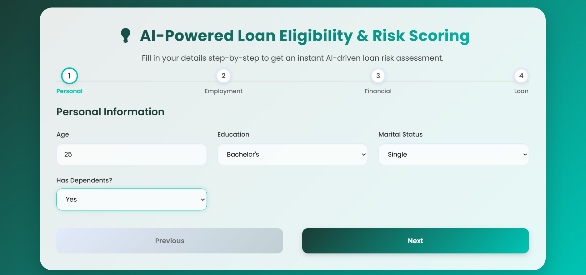
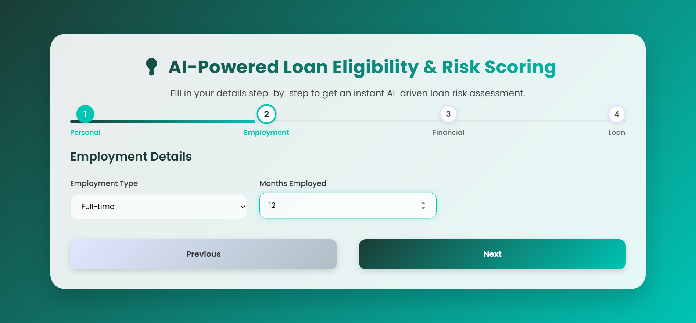
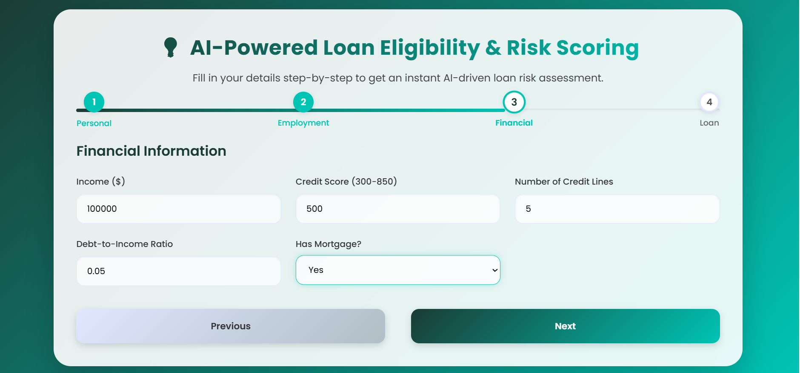
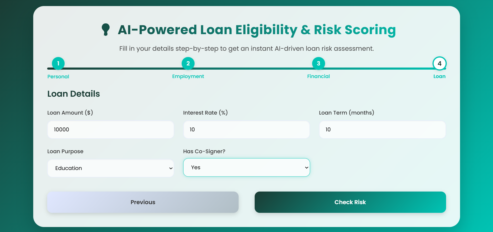
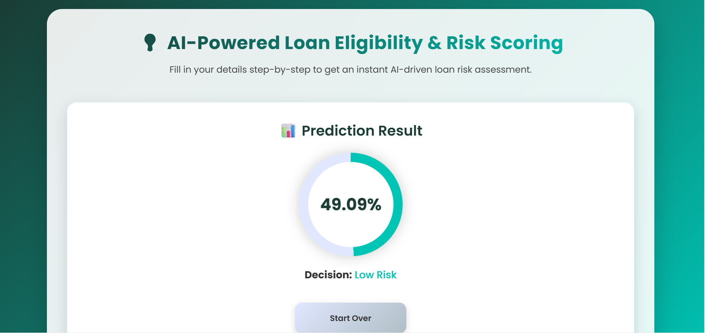

# 💡 AI-Powered Loan Eligibility & Risk Scoring  

An interactive **FastAPI + Machine Learning + Modern Frontend** project that predicts **loan approval risk** using an AI model.  
The system takes user financial and personal details, performs feature engineering, and predicts whether the applicant is **High Risk** or **Low Risk**.  

---

## 📌 Features  

✅ **FastAPI Backend** – Serves API endpoints for health check, predictions, and model info  
✅ **Scikit-learn ML Model** – Pre-trained classification model for loan risk scoring  
✅ **Feature Engineering** – Ratios, buckets, and engineered flags for accurate predictions  
✅ **Modern Frontend** – Multi-step form with progress bar, gradient UI, and result visualization  
✅ **Interactive Risk Meter** – Dynamic circular chart showing prediction probability  
✅ **CORS Enabled** – Frontend-backend integration with proper CORS middleware  
✅ **Logging** – Logs predictions and errors in the backend terminal  

---

## 🏗️ Tech Stack  

### 🔹 Backend  
- [FastAPI](https://fastapi.tiangolo.com/) – API framework  
- [scikit-learn](https://scikit-learn.org/) – ML model training & inference  
- [pandas](https://pandas.pydata.org/) – Data processing  
- [numpy](https://numpy.org/) – Numerical computations  
- [joblib](https://joblib.readthedocs.io/) – Model persistence  

### 🔹 Frontend  
- **HTML5, CSS3, JavaScript**  
- Multi-step loan application form with validation  
- Gradient-based modern UI (Poppins font, animated progress bar)  
- Risk score meter visualization  

---

## 📂 Project Structure  

loan-risk-system/
│
├── app.py # FastAPI backend (main entry)
├── artifacts/
│ ├── model.pkl # Trained ML model
│ └── metrics.json # Model performance metrics
│
├── frontend/
│ ├── index.html # Frontend entry
│ ├── style.css # Gradient & responsive UI
│ └── script.js # Form logic & API calls
│
├── output_screenshot/ # Output screenshots
│ ├── output1.jpeg
│ ├── output2.jpeg
│ ├── output3.jpeg
│ └── output4.jpeg
│
├── requirements.txt # Python dependencies
└── README.md # Documentation

---

## ⚙️ Setup & Installation  

### 1️⃣ Clone the repo  
git clone https://github.com/S-Karthikeyan-17/loan-risk-system.git
cd loan-risk-system

2️⃣ Create & activate virtual environment
python -m venv venv
.\venv\Scripts\activate   # On Windows
source venv/bin/activate # On Mac/Linux

3️⃣ Install dependencies
pip install -r requirements.txt

4️⃣ Run FastAPI server
uvicorn app:app --reload
Backend will be running at 👉 http://127.0.0.1:8000

5️⃣ Access frontend
Open in browser:
👉 http://127.0.0.1:8000/

🚀 API Endpoints
Method	Endpoint	Description
GET	/health	Check API health & model availability
POST	/predict	Get loan risk prediction (JSON request body)
GET	/model	Get model metrics (accuracy, precision, recall, etc.)

Example Request
POST /predict
{
  "Age": 30,
  "Income": 100000,
  "LoanAmount": 20000,
  "CreditScore": 650,
  "MonthsEmployed": 24,
  "NumCreditLines": 5,
  "InterestRate": 10,
  "LoanTerm": 12,
  "DTIRatio": 0.3,
  "Education": "Bachelor's",
  "EmploymentType": "Full-time",
  "MaritalStatus": "Married",
  "HasMortgage": "Yes",
  "HasDependents": "No",
  "LoanPurpose": "Business",
  "HasCoSigner": "No"
}

Example Response
{
  "risk_score": 0.4855,
  "decision": "Low Risk",
  "threshold": 0.5
}

📊 Output Screenshots
📌 Screenshots of the application are stored in the output_screenshot/ folder.

Screenshot	Preview
Step 1 – Personal Info Form	
Step 2 – Employment Details	
Step 3 – Financial Information	
Step 4 – Prediction Result	

🧠 Model Details
Trained using Scikit-learn classification algorithms

Input features: personal, employment, financial & loan details

Feature engineering:

Income-to-Loan ratio

Credit score per loan amount

Loan amount per credit line

Age buckets & DTI ratio buckets

Employment years & high interest flag

🛠️ Future Enhancements

✅ Deploy to cloud (AWS/GCP/Render)

✅ Add database support (PostgreSQL / MySQL)

✅ Improve model with ensemble learning (XGBoost, LightGBM)

✅ Add user authentication

✅ Provide explainable AI (SHAP / LIME)

👨‍💻 Author
Karthikeyan S
